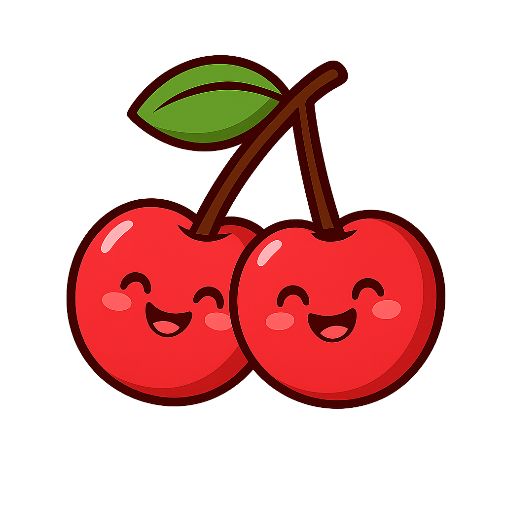

# 🍒 CherryDays — Period Nutrition & Wellness App

**CherryDays** is a simple and beautifully designed React Native app that empowers women to take charge of their wellness by syncing diet tips with the phases of their menstrual cycle.



## 🌸 Features

- 📅 **Period Calendar** – Track your cycle day-by-day with elegant visuals.
- 🧠 **Phase-Based Recommendations** – Tailored food and wellness tips for every cycle phase: Menstrual, Follicular, Ovulation, and Luteal.
- 🍽️ **Period Diet Guidance** – Smart suggestions for what to eat (and avoid) during each phase.
- 🌿 **Gentle Reminders** – Encouraging nudges to hydrate, rest, or nourish at just the right time.
- 🌈 **Soothing UI** – A soft, feminine interface using cherry tones and comforting typography.


## 🚀 Getting Started

### 📦 Requirements

- [Node.js](https://nodejs.org/)
- [Expo CLI](https://docs.expo.dev/get-started/installation/)
- A device or emulator to run the app

### 🛠️ Installation

```bash
git clone https://github.com/johanesm21/cherrydays.git
cd cherrydays
npm install
npx expo start